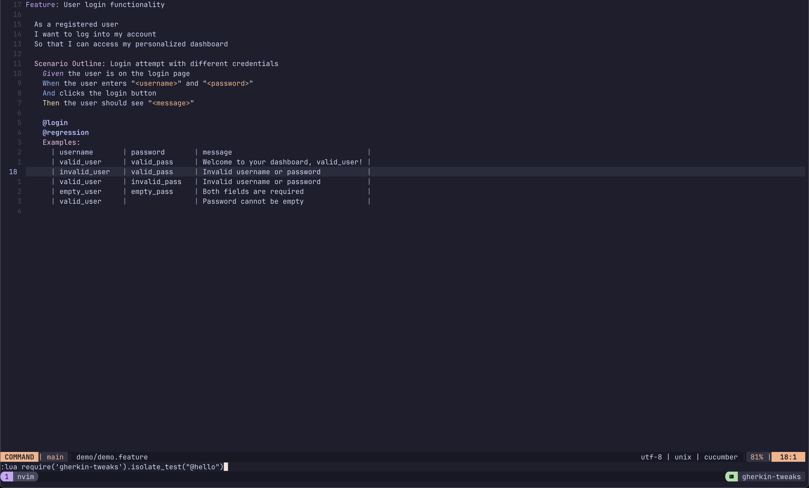
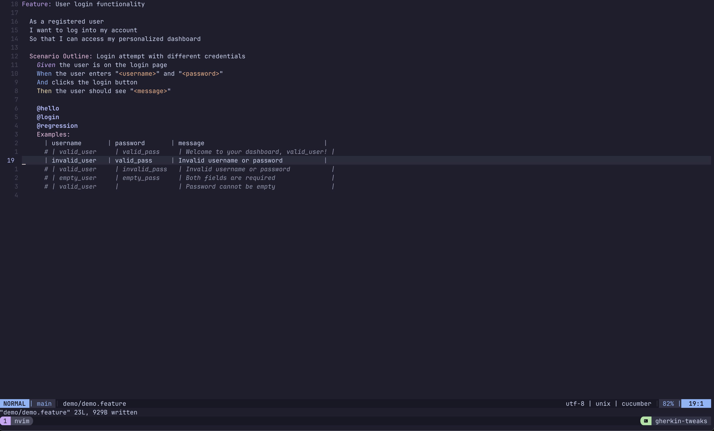
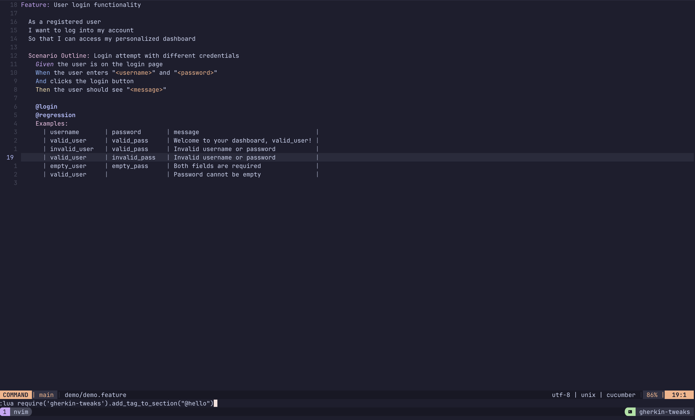
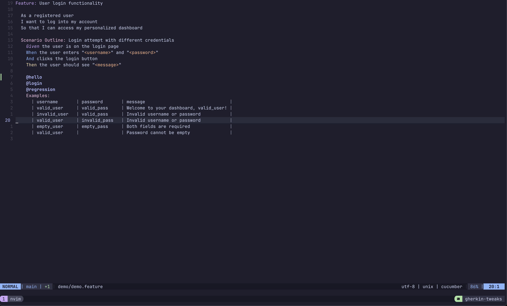
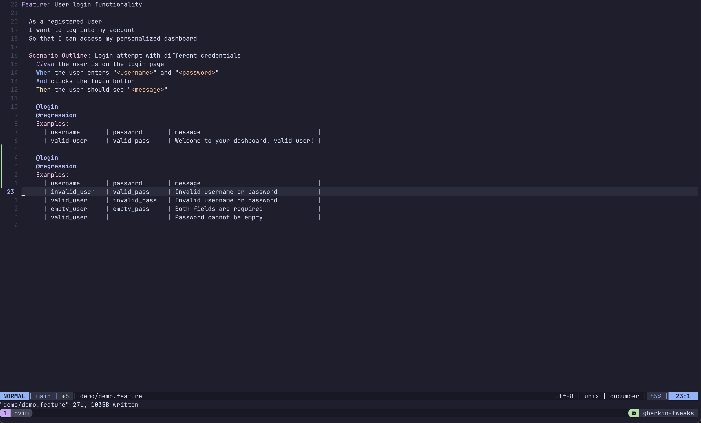
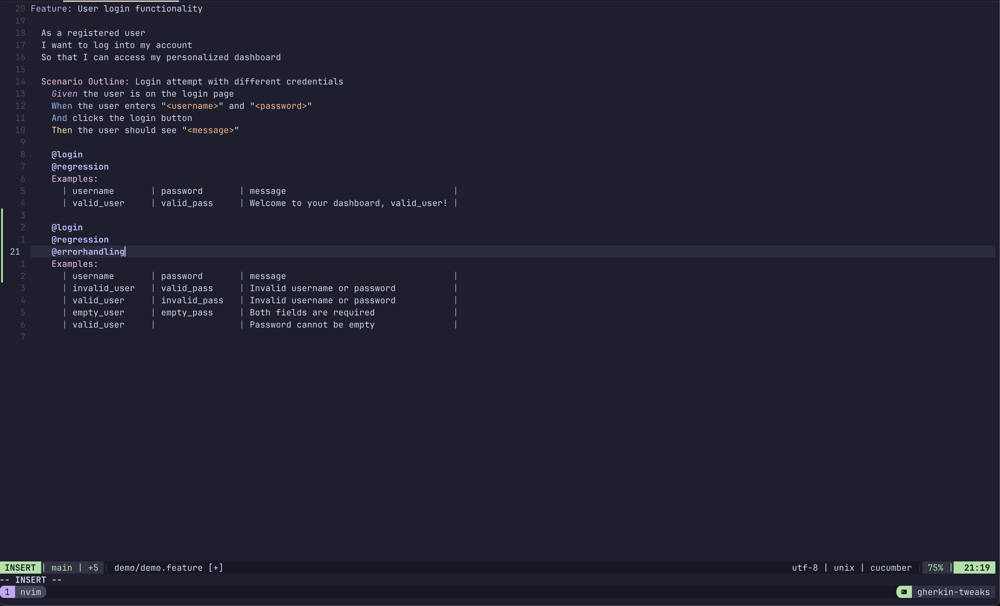

# gherkin-tweaks

## Purpose

Just some shortcuts for modifying .feature files

## Examples

### Isolate the current test for execution:

Setup the test example under the current line to run in isolation:

Before:



After:



### Add a tag to the current section for execution:

Before:



After:



### Copy previous table header

Before:


After:



Which allows you to make the edit you want to more quickly:



## Disclaimer

There's currently no error handling. So it assumes your cursor is in a place that makes sense for the given action, and also assumes your .feature file is formatted as expected (for example, in a way that `prettier --check` would accept).

## Installation

Using `packer`:

```
use({ "chrisj0110/gherkin-tweaks" })
```

## How To Use

Here is my current configuration:

```
require('gherkin-tweaks').setup({
    tag = '@cj', -- which tag to add unless one is passed in (defaults to `@mycustomtag`)
    auto_save = true, -- whether to save the buffer when called (defaults to `false`)
})

vim.keymap.set('n', '<leader>mi', require('gherkin-tweaks').isolate_test, { desc = 'Isolate just this gherkin test' })
vim.keymap.set('n', '<leader>mj', require('gherkin-tweaks').add_tag_to_section, { desc = 'Add tag to the top of the current gherkin section' })
vim.keymap.set('n', '<leader>me', require('gherkin-tweaks').copy_table_header, { desc = 'Copy the previous gherkin table header above the current line' })
```

Or you can call functions directly, for example:

`:lua require('gherkin-tweaks').isolate_test("@hello")`

Whether calling directly or using a mapping, you can choose to pass in an optional tag (like `@hello` above), or else it will use the one in your setup.

