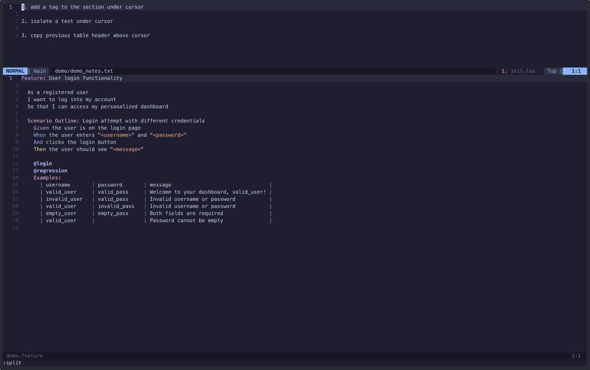

# gherkin-tweaks

## Purpose

Just some shortcuts for modifying .feature files

## Examples:



## Disclaimer

This plugin currently has no error handling. So it assumes your cursor is in a place that makes sense for the given action, and also assumes your .feature file is formatted as expected (for example, in a way that `prettier --check` would accept).

## How To Use

Here is my current configuration using [lazy.nvim](https://github.com/folke/lazy.nvim):

```lua
return {
    "chrisj0110/gherkin-tweaks",
    config = function()
        require('gherkin-tweaks').setup({
            tag = '@cj',
            auto_save = true,
        })

        vim.keymap.set('n', '<leader>mi',
        require('gherkin-tweaks').isolate_test,
        { desc = 'Isolate just this gherkin test' })

        vim.keymap.set('n', '<leader>mj',
        require('gherkin-tweaks').add_tag_to_section,
        { desc = 'Add tag to the top of the current gherkin section' })

        vim.keymap.set('n', '<leader>me',
        require('gherkin-tweaks').copy_table_header,
        { desc = 'Copy the previous gherkin table header above the current line' })
    end
}
```

Or you can call functions directly, for example:

```lua
:lua require('gherkin-tweaks').isolate_test("@hello")
```

Whether calling directly or using a mapping, you can choose to pass in an optional tag (like `@hello` above), or else it will use the one in your setup.

